[TOC]
# 动态规划
## 核心思想
- **要保证当前计算的问题的全部子问题都已经计算过了, 并且每一个子问题已经是最优解!**
- 回溯时, 只能倒推(自顶向下), 因为每一个底问题都会推出一个最终解, 而仅有我们求出来的最终解是最优的, 因此要倒推。
## 切割钢条
### 方案
- 共$2^{n+1}$种
### 理解算法
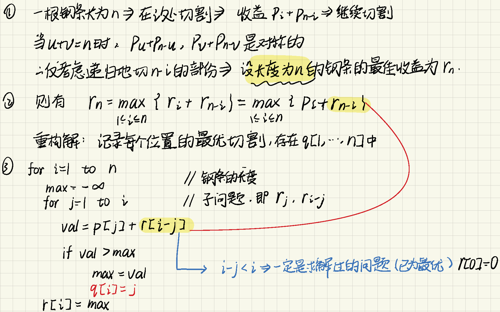
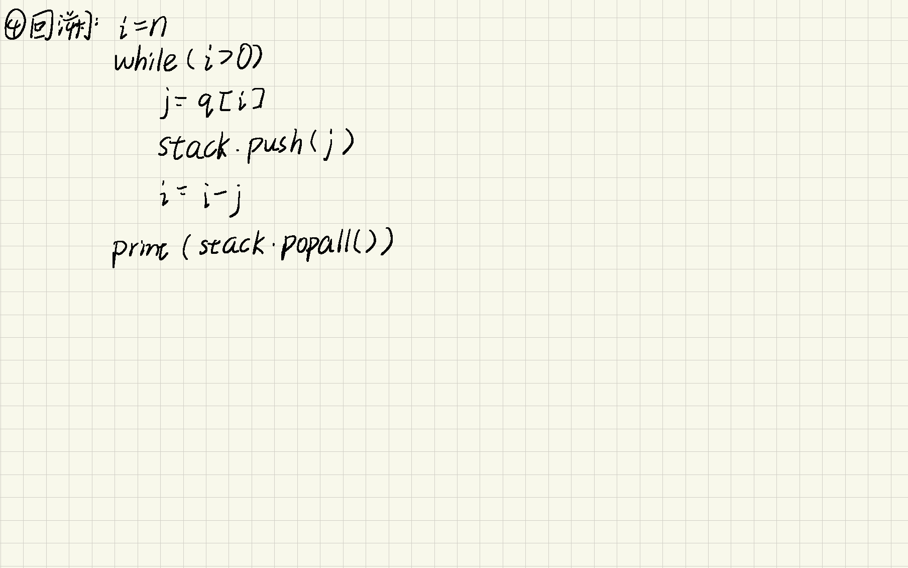
## 矩阵链乘
### 方案
- 共$\sum_{i=2}^n(n-i+1)$
### 理解算法
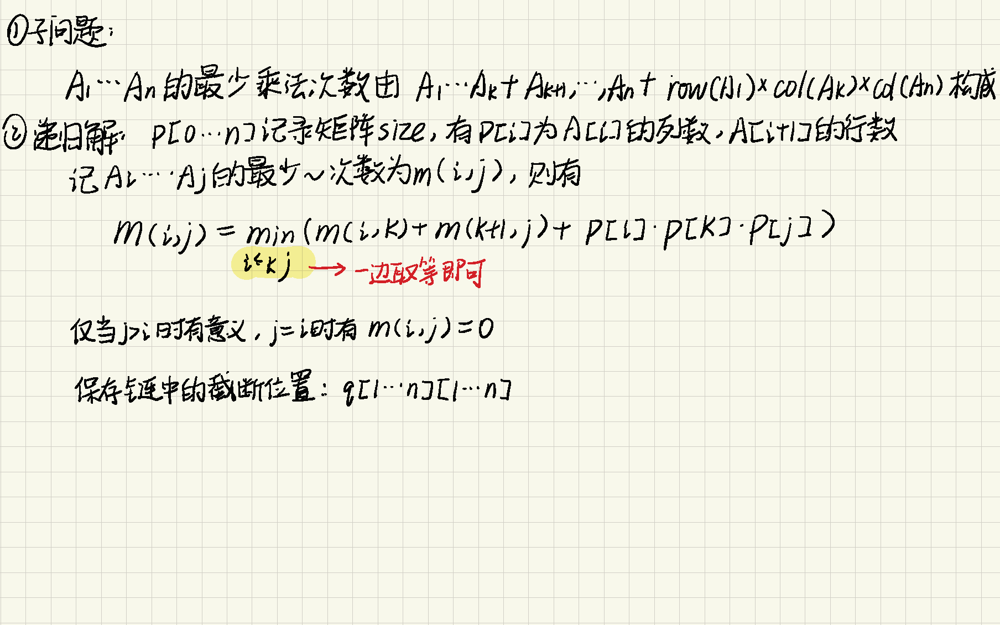
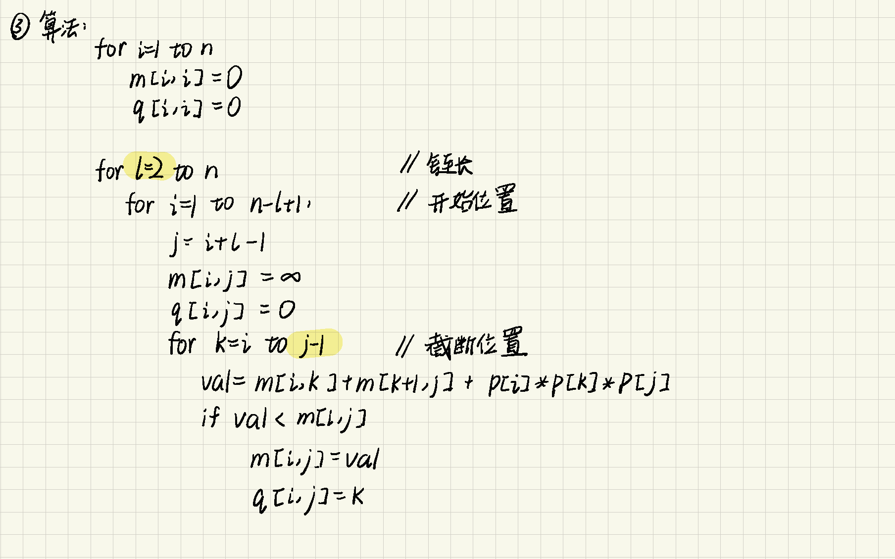
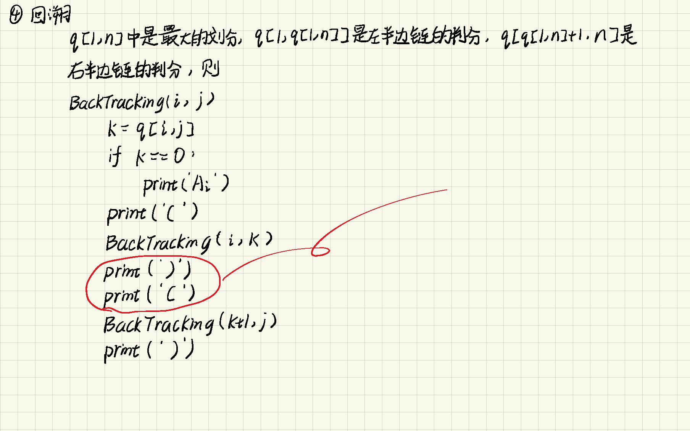
## 公共子序列
### 方案
- 共$2^n$种, 其中$n$为$X$的长度
### 理解算法
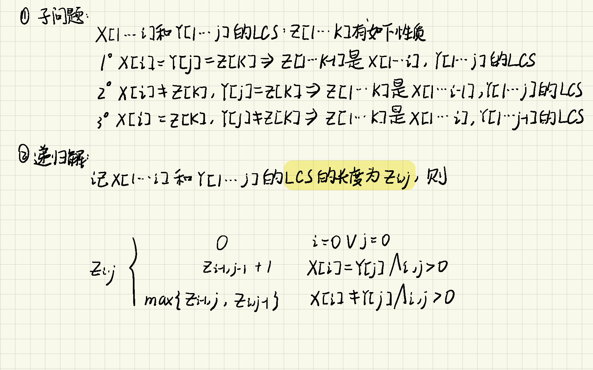
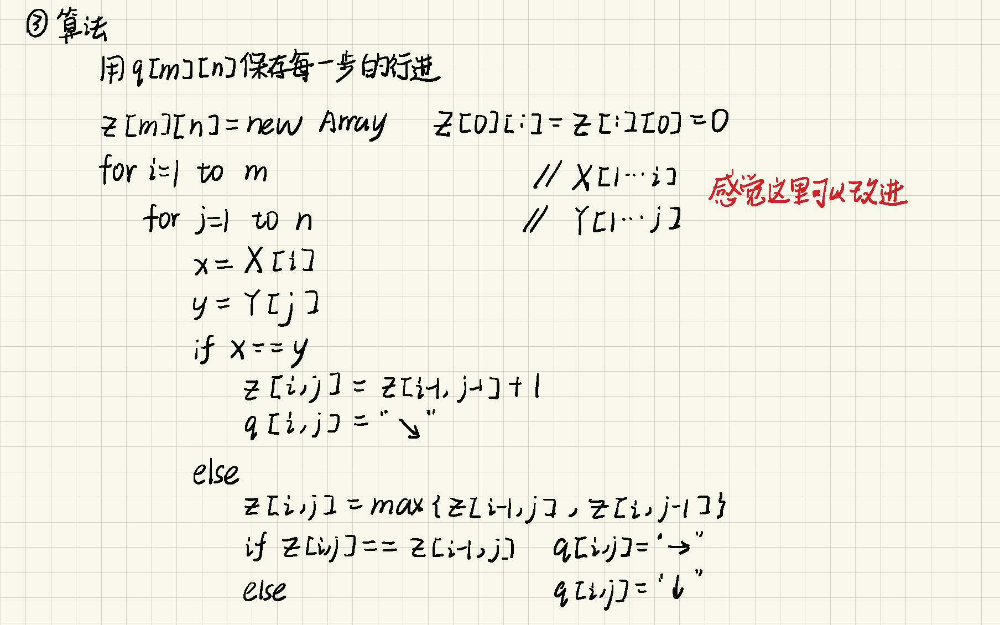
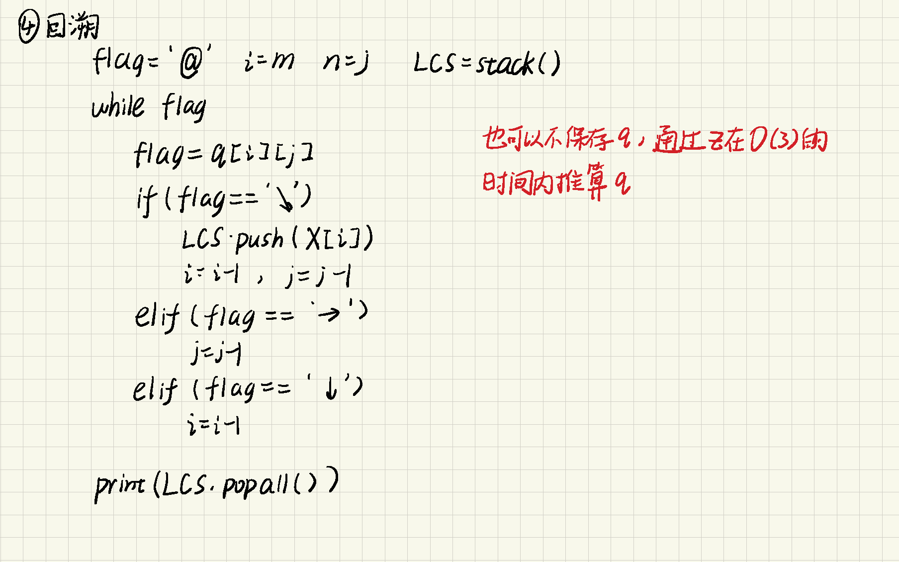

## 0-1背包问题
### 方案
- 共$2^n$种, 因为每一个物品都要尝试拿/不拿
### 理解算法
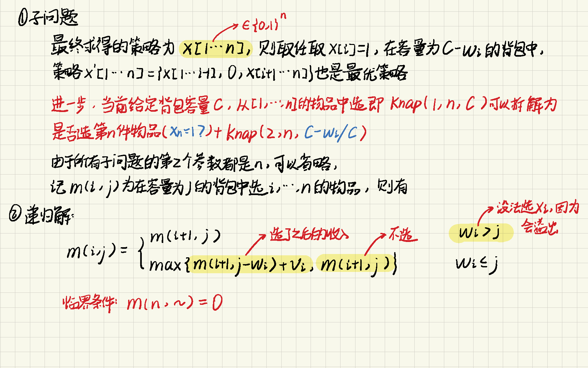
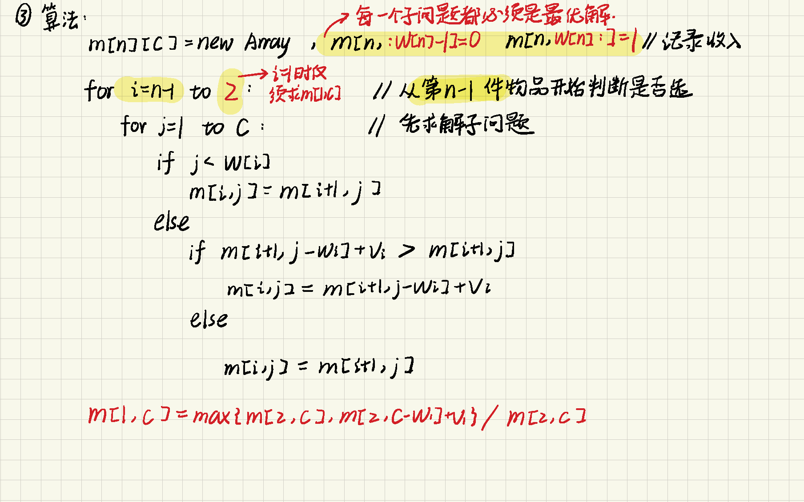
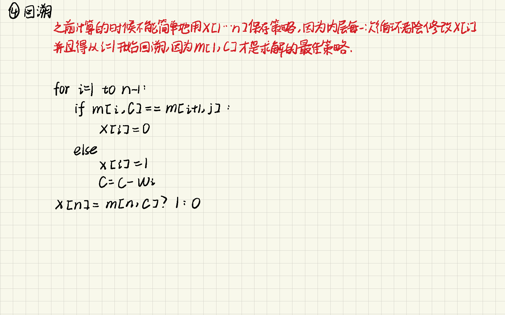
